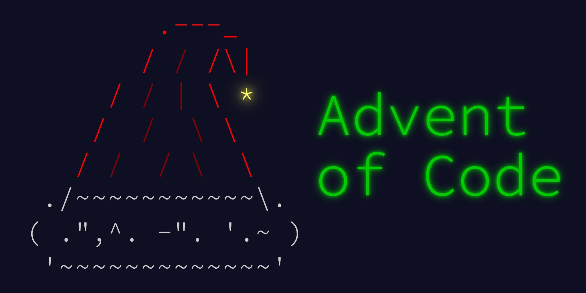

# AventOfCode 2021

> Advent of Code is an Advent calendar of small programming puzzles for a variety of skill sets and skill levels that can be solved in any programming language you like.

| Day | What | Part 1 comment | Part 2 comment |
|-----|----------------|----------------|----------------|
| 1   | Sonar Sweep | *none* | *none* |
| 2   | Dive! | *none* | *none* |
| 3   | Binary Diagnostic | *none* | *none* |
| 4   | Giant Squid | *none* | *none* |
| 5   | Hydrothermal Venture | *none* | Go to hell diagonals |
| 6   | Lanternfish  | *none* | Had to re-think in order to make it fastly computable |
| 7   | The Treachery of Whales  | Use `do` with the median | Proabaly a math function do determine the best position. Don't care bruteforce FTW |
| 8   | Seven Segment Search  | *none* | *none* |
| 9   | *TBD*  | *none* | *none* |
| 10  | *TBD*  | *none* | *none* |
| 11  | *TBD*  | *none* | *none* |
| 12  | *TBD*  | *none* | *none* |
| 13  | *TBD*  | *none* | *none* |
| 14  | *TBD*  | *none* | *none* |
| 15  | *TBD*  | *none* | *none* |
| 16  | *TBD*  | *none* | *none* |
| 17  | *TBD*  | *none* | *none* |
| 18  | *TBD*  | *none* | *none* |
| 19  | *TBD*  | *none* | *none* |
| 20  | *TBD*  | *none* | *none* |
| 21  | *TBD*  | *none* | *none* |
| 22  | *TBD*  | *none* | *none* |
| 23  | *TBD*  | *none* | *none* |
| 24  | *TBD*  | *none* | *none* |
| 25  | *TBD*  | *none* | *none* |